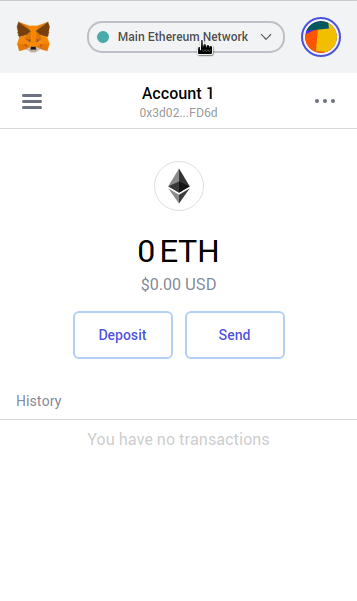
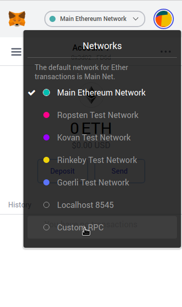
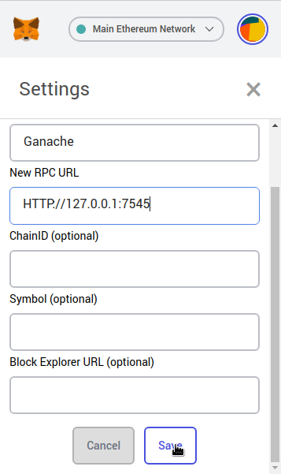
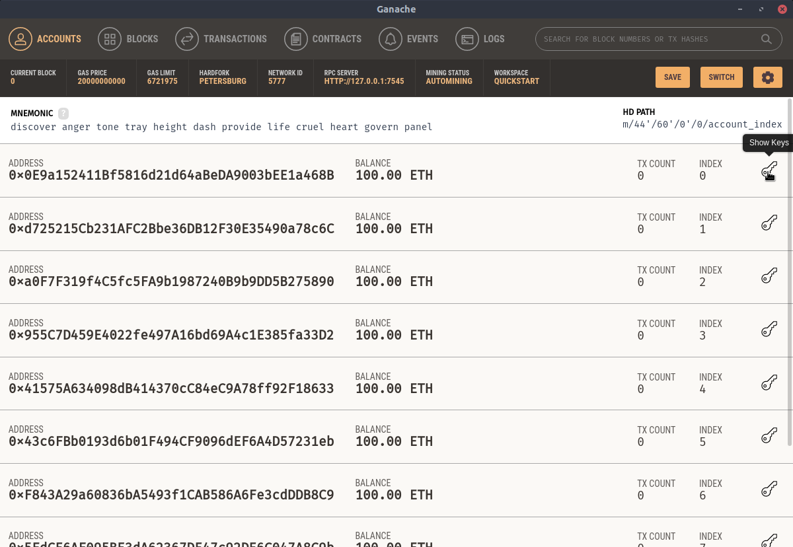
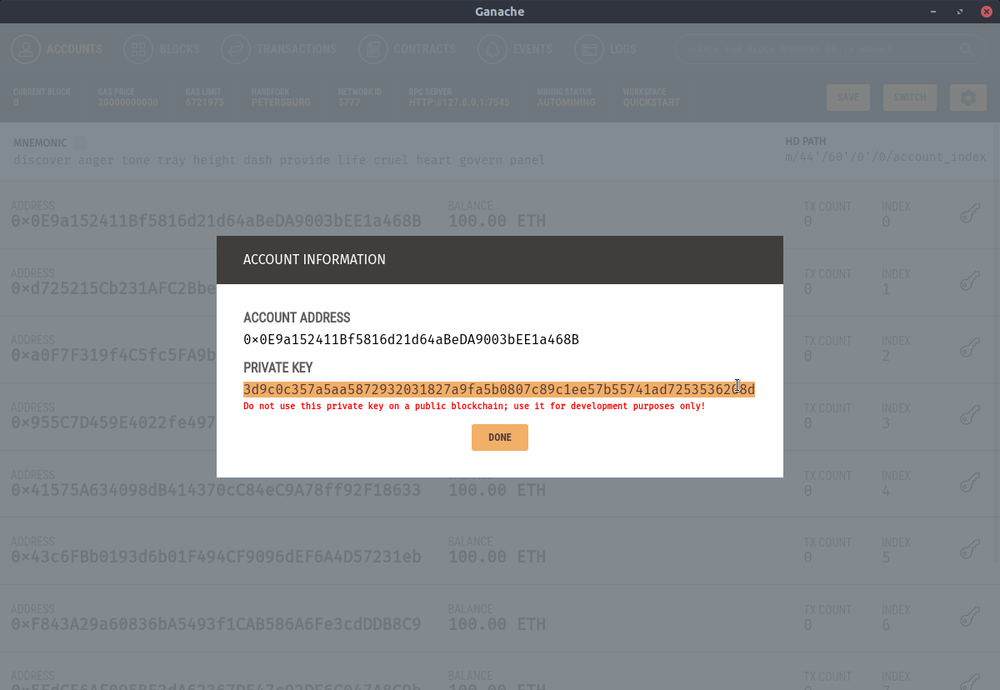
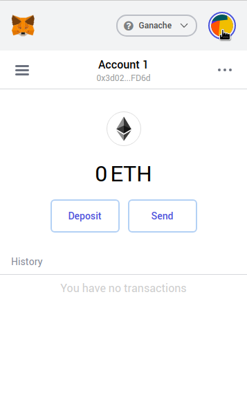
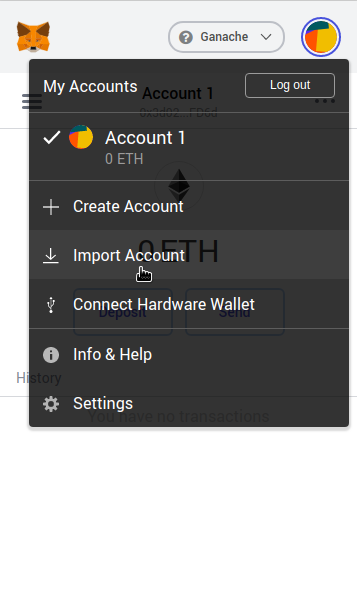
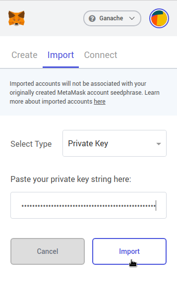
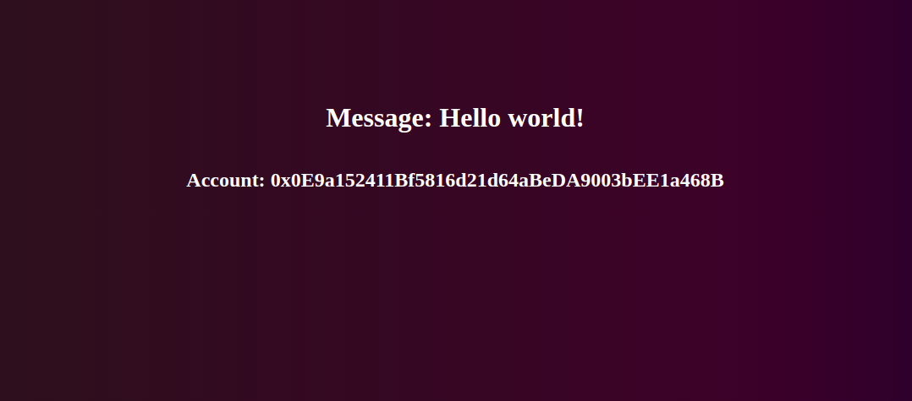

# Ethereum - Hello world

## Description

**Ethereum Hello World** project have been created in order to present the basics of programming decentralized applications (dApp) on Ethereum. As a beginner, it's not easy to start developing in the field of Ethereum's blockchain. That's why this project aims to keep it simple by presenting the basics.

In this project you can :
- see how to write your first smart contract
- learn how to deploy it on a local blockchain
- get a visual overview of the result as a dApp

## Installation

### I. Prerequisites

1. You will need **nodeJS** and **npm** (Node Package Manager) to get all dependencies and run the project. Then, install **truffle** with npm so that you can compile, test and deploy smart contracts
    ```sh
    sudo apt-get install nodejs
    npm install -g truffle
    ```
2. Then download [**Ganache**](https://www.trufflesuite.com/ganache), a local blockchain to simulate Ethereum's blockchain
3. Finally, download [**MetaMask**](https://metamask.io/), a Google chrome extension to communicate between Chrome and Ganache

### II.  Run ganache

Find out where you downloaded ganache and run it like this:
```sh
chmod 755 yourGanache.AppImage
./yourGanache.AppImage
```
Then click on **Quick Start** to get Ganache running

### III. Project set up

Now that Ganache is running you have everything you need to set up the project. You can clone the repository, download required dependencies, compile smart contracts, test them and deploy them on Ganache like so :
```sh
git clone git@github.com:LouisHatte/Ethereum-helloWorld.git
cd Ethereum-helloWorld/
sudo npm install
truffle compile
truffle test
truffle migrate --reset
```

### IV.  Configure MetaMask

After creating an account and logging in, you need to add ganache to the list of Metamask networks. To do so, follow the images below :





Then you have to import an account from your local blockchain like so :



<br />
<br />




### V. Run the project

Make sure that you have Ganache running and MetaMask connected on Ganache with a Ganache account then you can run the project :
```sh
cd Ethereum-helloWorld/
sudo npm run start
```
If everything is fine, you should see this in your browser on *localhost:3000* :



### VI. Interact with the HelloWorld smart contarct

The *Hello world!* message you can see on the screen correspond to the state variabe *message* that you can see in your HelloWorld smart contract
You can change its value with the update() method from your smart contract like so :
```sh
cd Ethereum-helloWorld/
truffle console
truffle(development)> instance = await HelloWorld.deployed()
truffle(development)> instance.message()
'Hello world!'
truffle(development)> instance.update('New value')
truffle(development)> instance.message()
'New value'
.exit
```

## TODO
1. Add logo
2. boyscoot
